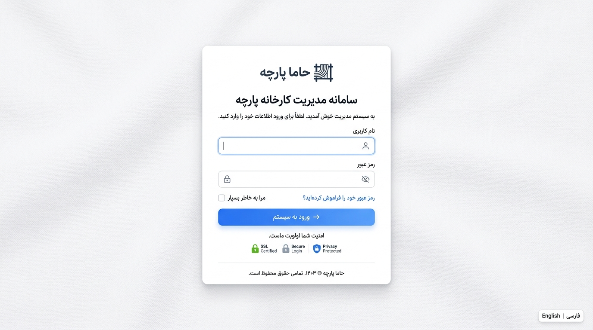
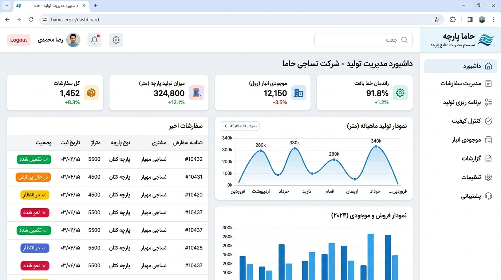
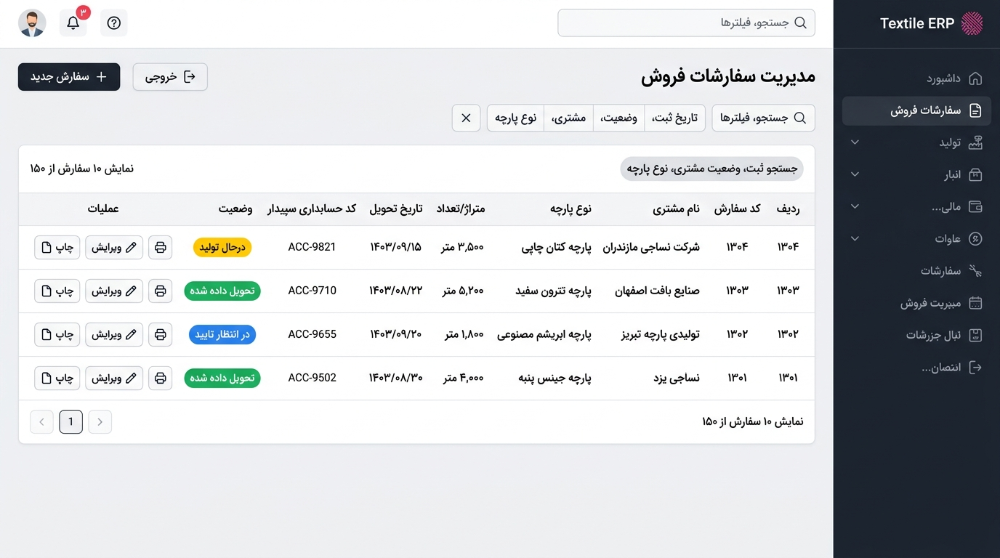
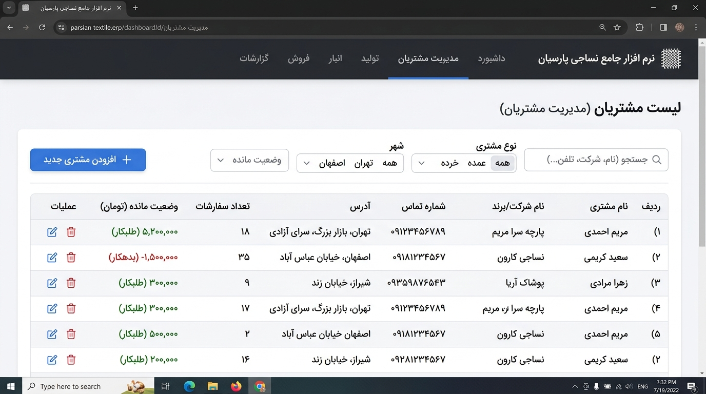
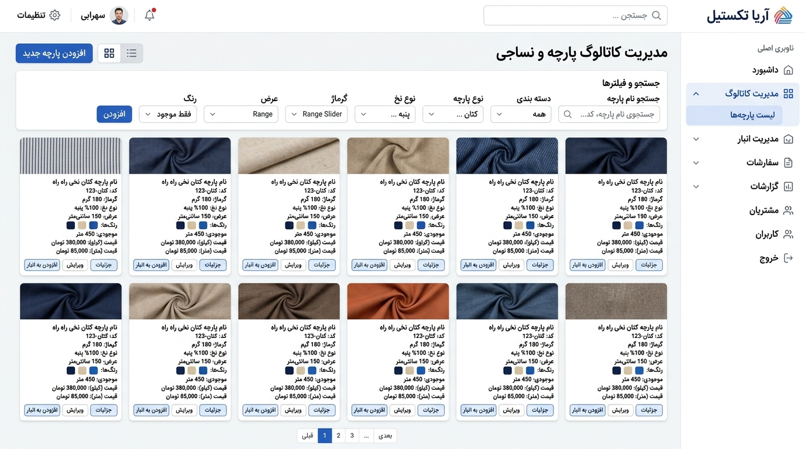
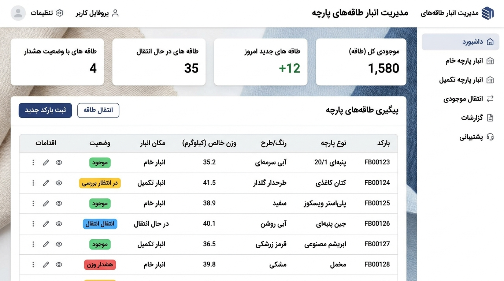
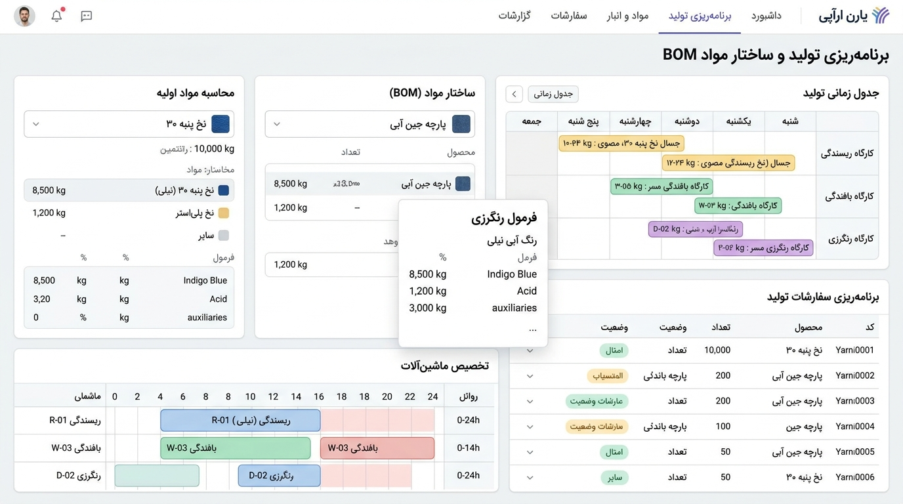
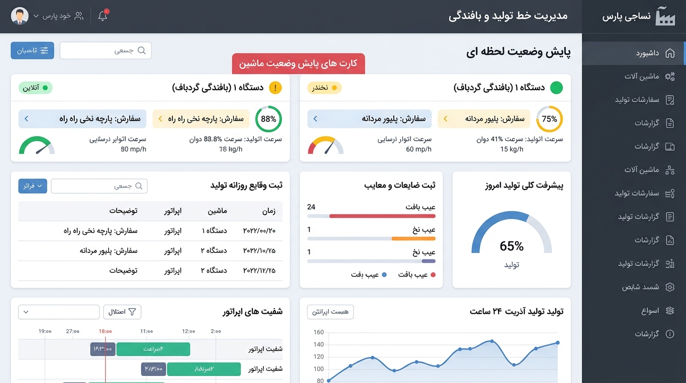

# 🧵 سامانه جامع مدیریت کارخانه پارچه و نساجی حاما (Hama Textile ERP)


**سامانه ERP اختصاصی صنایع نساجی و تولید پارچه حاما** یک سیستم یکپارچه مدیریت منابع سازمانی است که ویژه برنامه‌ریزی، کنترل تولید، انبارداری طاقه‌های پارچه، مدیریت مشتریان، سفارشات فروش و حسابداری طراحی شده است.

---

## 📸 تصاویر و پیش‌نمایش محیط نرم‌افزار (Screenshots)

### 🔑 صفحه ورود به سامانه (Login)


### 📊 میز کار و داشبورد مدیریتی (Dashboard)


### 🛒 مدیریت سفارشات فروش (Orders Management)


### 👥 مدیریت مشتریان و خریداران (Customers Management)


### 🎨 کاتالوگ پارچه‌ها و محصولات (Products & Fabric Catalog)


### 📦 مدیریت انبار و طاقه‌های پارچه (Warehouse & Inventory)


### 🗓️ برنامه‌ریزی تولید و فرمول فرمولاسیون BOM (Production Planning)


### ⚙️ پایش خط تولید و دستگاه‌های بافندگی (Production Execution)


---

## ✨ امکانات و قابلیت‌های اصلی سیستم

- **🔐 مدیریت کاربران و سطوح دسترسی پیشرفته:** تعیین دسترسی به بخش‌های مختلف (میزکار، مشتریان، سفارشات، انبار، خط تولید و...) با قابلیت تغییر امن رمز عبور.
- **📈 داشبورد و آمارهای زنده:** مشاهده شاخص‌های کلیدی عملکرد (KPI)، میزان تولید روزانه و ماهانه، وضعیت انبار و سفارشات فعال.
- **🧾 مدیریت کامل سفارشات:** ثبت کد سپیدار، جزییات متراژ/گرماژ، وضعیت ساخت، پیوست فایل‌های طراحی و تاریخ تحویل.
- **🏬 انبارداری تخصصی نساجی:** ثبت و انبارداری طاقه‌های پارچه با شماره طاقه، وزن خالص، وضعیت رنگ‌رزی و تکمیل، همراه با قابلیت اسکن بارکد.
- **🛠️ برنامه‌ریزی و ساختار مواد (BOM):** محاسبه دقیق میزان نخ مصرفی، رنگ و مواد شیمیایی مورد نیاز بر اساس سفارشات.
- **⚙️ پایش دستگاه‌ها و شیفت‌های کاری:** ثبت لاگ‌های تولید روزانه، خرابی دستگاه‌ها و توقفات خط بافندگی.

---

## 🛠️ تکنولوژی‌های استفاده شده (Tech Stack)

- **Backend:** Python 3.11 / Django 5.x
- **Database:** SQLite / PostgreSQL / psycopg2
- **Frontend:** HTML5, CSS3, JavaScript (ES6+), Bootstrap 5 (RTL), Feather Icons
- **Date Handling:** `jdatetime` (تقویم خورشیدی / هجری شمسی)
- **PDF & Image Processing:** Pillow, ReportLab

---

## 🚀 راهنمای نصب و اجرا (Installation & Setup)

1. **کلون کردن مخزن پروژه:**
   ```bash
   git clone https://github.com/your-username/textile-erp.git
   cd textile-erp
   ```

2. **ایجاد و فعال‌سازی محیط مجازی (Virtual Environment):**
   ```bash
   python -m venv venv
   # در لینوکس/مک:
   source venv/bin/activate
   # در ویندوز:
   venv\Scripts\activate
   ```

3. **نصب نیازمندی‌ها (Dependencies):**
   ```bash
   pip install -r requirements.txt
   ```

4. **اجرای مایگریشن‌های دیتابیس (Migrations):**
   ```bash
   python manage.py migrate
   ```

5. **اجرای سرور توسعه (Development Server):**
   ```bash
   python manage.py runserver
   ```

6. **ورود به سیستم:**
   - **آدرس ورود:** `http://127.0.0.1:8000/login/`
   - **نام کاربری پیش‌فرض:** `admin`
   - **رمز عبور پیش‌فرض:** `admin123`

---

## 📂 ساختار پوشه‌ها (Directory Structure)

```text
textile-erp/
│
├── assets/
│   └── images/
│       ├── dashboard.png
│       ├── customers.png
│       ├── products.png
│       ├── warehouse.png
│       ├── orders.png
│       ├── production.png
│       ├── planning.png
│       └── login.png
│
├── core/               # برنامه‌ریزی اصلی، داشبورد و بیس تمپلیت‌ها
├── customers/          # ماژول مدیریت مشتریان
├── orders/             # ماژول سفارشات فروش و فایل‌های طراحی
├── products/           # کاتالوگ محصولات و مشخصات پارچه‌ها
├── production/         # ماژول خط تولید، BOM و پایش دستگاه‌ها
├── users/              # مدیریت کاربران، پروفایل‌ها و رمز عبور
├── warehouse/          # انبارداری و مدیریت طاقه‌های پارچه
│
├── manage.py
├── requirements.txt
└── README.md
```

---

## 📜 مجوز (License)

این پروژه تحت مجوز MIT منتشر شده است.
